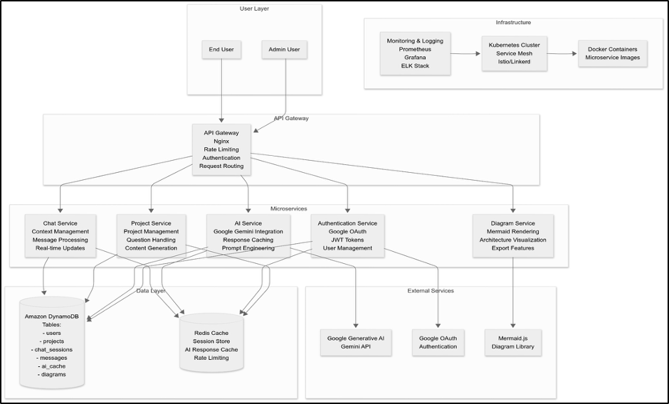

# Project Idea 1- Project Weaver — AI-Powered Project Management Platform

## **1\) Introduction**

Weaver is an AI-first platform for modern project management and software architecture planning. It pairs Google Gemini–powered assistance with intuitive visuals (Mermaid.js) to accelerate ideation → design → delivery for technical and non-technical teams.

## **2\) Objectives**

**Primary**

1. MVP to Production: Build a cloud-based system that can grow from a basic version to a full multi-user production system.  
2. AI-First: Use Gemini to help with planning, architecture, and smart assistance.  
3. Scalability: Design the system to expand easily and keep different users' data separate.

## **3\) Scope**

1. Foundational architecture; Auth (Google OAuth 2.0, JWT), roles/permissions  
2. AI service (Gemini, prompt orchestration, caching, guardrails)  
3. Project/collab (CRUD, context, chat, presence, activity)  
4. Diagramming (Mermaid.js, versioning/exports)  
5. Data layer (DynamoDB \+ Redis), API gateway (Nginx), containers (Docker), orchestration (Kubernetes)  
6. Observability (Prometheus, Grafana), CI/CD, testing, OpenAPI docs  
     
     
     
   

## **4\) Architecture Overview**

## **5\) Technology Stack**

**Frontend:** Next.js 15 \+ React 19, Tailwind, React hooks/context, server actions, custom UI.  
**Backend:** [Next.js](http://Next.js) 15 \+, Google OAuth 2.0 \+ JWT, Gemini, DynamoDB, Redis.  
**Infra/Tooling:** Nginx, Docker, Kubernetes, (Mesh later), Prometheus/Grafana, ELK, GitHub \+ Actions,  ESLint/Prettier, Jest/RTL, OpenAPI.

## **6\) 12-Week Implementation Plan (Sep 16 → Dec 8, 2025\)**

**Weeks 1–3: Foundation**

* Cloud environments, baseline IaC; repo \+ monorepo scaffolding & package standards  
* CI/CD (build/test/deploy), base Docker images  
* API Gateway skeleton & routes; skeleton services; auth wiring (Google)

**Weeks 4–6: Core Platform**

* Auth service (Google OAuth, JWT), logging  
* Project service (CRUD, tenancy); DynamoDB schema \+ seed tooling  
* Nginx policies (auth, rate limits); initial frontend (auth, projects list/detail)

**Weeks 7–9: AI Integration**

* AI service (Gemini) with prompt templates, persona/guardrails  
* Redis caching, retries, circuit breakers; error handling/observability for AI calls  
* UX: AI-assisted planning and Q\&A flows in projects

**Weeks 10–12: Collaboration, Diagrams, Prod Readiness**

* Real-time chat/presence, context threads; activity feeds  
* Mermaid.js diagram service (render, version, export); file export/upload flows  
* Alerting and Monitoring  
* **Exit criteria**: MVP complete and readiness by end of Week 12

## **7\) Risks & Mitigations**

* **AI integration** → Start small with AI, test it well, and have backup plans.  
* **Service boundaries** → Build as one piece initially, then break off parts as they become clear; limit how much services talk to each other.  
* **DynamoDB unknowns** → Design the data structure first, test it with fake data, and use other database types if needed.  
* **Scope & schedule** → Keep the task list clean, have checkpoints, show progress every two weeks, and focus on what's most important.

[image1]: 

---

# Project idea 2 — Autonomous Job Application Assistant

Job seekers spend hours searching across multiple job boards, dealing with duplicate postings, and repeatedly tailoring resumes and filling application forms. Current platforms don’t help streamline this process or ensure transparency in how AI is used.

## **1\) Scope & Goals**

**Goal:** Our project aims to create a Job Application Assistant that:

* Continuously discovers and curates relevant jobs from multiple sources.
  
* Lets users approve every step (resume edits, form-fill answers).
 
* Automatically tailors resumes/cover letters using a knowledge base.
  
* Keeps a full audit trail (versioned artifacts, logs, timestamps)
  
**Key outcomes**

* Fresh, deduped job feed from LinkedIn, Indeed, Y Combinator, and major boards.

* Human-in-the-loop approvals at every critical step (listing selection, form fields, resume edits).

* Versioned artifacts (resume \+ cover letter) stored with job metadata and timestamps.

* Functional, auditable UI first; agentic automation second.

---

## **2\) System Architecture (high level)**

* **Frontend (Web UI):** Next.js/React, Tailwind, shadcn/ui; WebSocket streams for live agent progress.

* **Orchestrator/API:** FastAPI (Python) or Node (Express) to expose endpoints, manage sessions, and broker approvals.

* **RAG & LLM:**

  * **Local** (user preference): Ollama (e.g., Llama 3.1 8B) for generation; bge-small/e5-small for embeddings.

  * **Vector store:** SQLite \+ FAISS (lightweight, M1-friendly).

* **Browser automation:** Playwright (headed mode) with a “controlled browser” and DOM diff overlay; fall back to user-click automation (semi-auto).

* **Scheduler:** APScheduler (interval jobs with user-defined cadence).

* **Storage:**

  * **DB (SQLite/Postgres):** jobs, applications, approvals, artifacts, knowledge docs.

  * **Blob store:** local FS (`/data/artifacts/…`) for PDFs/DOCs; checksum for dedupe.

* **Logging & Audit:** Structured logs (JSON), per-step traces, field-level provenance.

---

## **3\) Core Modules**

1. **Ingestion & Discovery**

   * Sources: YC Work at a Startup API/feeds, Indeed RSS (where available), company career pages, user-provided searches.

   * Scraper adapters normalize to a common schema; dedupe by URL \+ title \+ company \+ location.

2. **Ranking & Match Scoring**

   * **Score(job, profile)** \=  
      `0.4·semantic_sim(resume, JD)` \+ `0.25·keyword_coverage(JD, resume)` \+ `0.15·recency(job_posted)` \+ `0.1·eligibility(location, visa)` \+ `0.1·seniority_fit`

   * Semantic via sentence embeddings; coverage via tf-idf/keyword hit; configurable weights.

3. **RAG Knowledge Base**

   * Sources: user’s resumes, bullets, projects, metrics, portfolio links, testimonials.

   * Chunk to \~512–800 tokens; store embeddings \+ metadata (dates, roles, skills).

   * Retrieval prompts generate **justifications** and **citations** per field.

4. **Resume/Cover Tailoring**

   * Strategy: constrained editing with **diff view**.

   * Preserve ATS compatibility: reverse-chronological, consistent headers, plain bullets with quantified impact.

   * Safety rails: jargon cap, length caps, “no hallucinated employers” rule, citations to RAG chunks.

5. **Form-Fill & Live Approval**

   * For each detected field: show **Question**, **Proposed Answer**, **Provenance (RAG chunks)**, **Risk flag** (low/high).

   * User can **Accept**, **Edit**, or **Reject** per field. Accepted fields auto-fill via Playwright.

6. **Submission & Evidence**

   * Store submitted artifacts \+ timestamp \+ JD snapshot \+ site \+ status.

   * Keep **proof bundle**: PDF of tailored resume, cover letter, applied answers (JSON), screenshots hash (optional).

---

## **4\) Functional UI (focus)**

**Pages & key components**

* **Jobs Listing:** filters (role, level, location, remote), sort by **Match Score**; badges for source & freshness.

* **Job Detail Drawer:** JD text, **Match breakdown** (semantic, keyword, eligibility), “Tailor Resume” CTA.

* **Tailor Workspace:** split view

  * Left: JD \+ extracted requirements (bulleted).

  * Right Tabs:

    * **Resume Diff** (accept/revert hunks).

    * **Cover Letter Draft** (structured, editable).

    * **Form Fill Queue**: table of fields → \[Question | Proposed | Source | Actions\].

* **Live Browser Panel:** embedded or external window; step log with Playwright screenshots; “Pause / Resume / Step”.

* **History & Artifacts:** searchable timeline; per application card links to files, JD snapshot, and status.

---

## **5\) Data Model (concise)**

**jobs**(id, title, company, location, remote, url, source, posted\_at, jd\_text, hash)  
 **profiles**(id, user\_id, name, base\_resume\_path, skills\[\], eligibility{work\_auth, location})  
 **knowledge\_docs**(id, profile\_id, type, content, embedding, source\_meta, updated\_at)  
 **match\_scores**(job\_id, profile\_id, semantic, keywords, eligibility, seniority, total)  
 **applications**(id, job\_id, profile\_id, status{draft, pending, submitted, rejected, interview}, submitted\_at)  
 **artifacts**(id, application\_id, kind{resume, cover, qa\_json, screenshots}, path, checksum, created\_at)  
 **field\_proposals**(id, application\_id, site, question, proposed, provenance\_doc\_ids\[\], state{proposed, accepted, edited, rejected}, final\_value)

---

## **6\) Agent Flow (E2E)**

1. **Schedule tick** → ingest new jobs → rank & dedupe → create/refresh listing.

2. User opens app → reviews **curated jobs** → selects job(s).

3. **Tailor step** → RAG retrieves relevant bullets → LLM proposes edits → user approves per hunk.

4. **Form-fill step** → agent reads fields → proposes values with citations → user approves/edits → agent fills.

5. **Submit (manual or auto)** → store artifacts \+ status → show success & log.

6. **Follow-ups** (optional): reminders for assessments/emails; update status via links or mailbox hooks.

---

## **7\) Prompts & Guardrails (essentials)**

* **Retrieval prompt**: “Given JD and profile chunks, return bullet candidates with source IDs; do not invent employers/titles; quantify impact.”

* **Edit prompt**: “Apply only these diffs; preserve structure; cap section length; maintain consistent dates.”

* **Form-fill prompt**: “Answer in short prose; cite source chunk IDs; mark as ‘Unknown’ if not in KB.”

* **Validation**: regex/date checks; “No Hallucination” filter rejects content without provenance.

---

## **8\) Privacy, Security, & Compliance**

* Local-first processing; no third-party calls by default (Ollama).

* Secrets vault for site credentials; never store raw passwords in DB.

* Respect site ToS; prefer user-driven “Assist Mode” over fully autonomous submit.

* Optional **CAPTCHA** handling: always human-in-the-loop.

---

## **9\) Performance & Footprint (M1 Air, 16 GB)**

* Models: Llama 3.1 8B (generation), **bge-small** or **e5-small** (embeddings).

* Batch ingestion with rate limiting; incremental vector updates.

* Pre-compute JD embeddings on ingest; cache match scores.

* PDFs via `pypdf`/`docx` conversion kept minimal; heavy OCR avoided.

---

## **10\) Quality & Evaluation**

* **Offline eval set**: 50 JDs × 3 base resumes; measure:

  * Match score correlation with interviewer judgments.

  * Edit precision (accepted hunk %) & provenance coverage %.

  * Submission success rate (no validation errors).

* **A/B**: different weighting schemas; diff acceptance friction.

---

## **11\) Milestones (indicative)**

**Week 1** — Ingestion MVP (YC \+ RSS), schema, listings UI.  
 **Week 2** — RAG KB \+ match scoring; Tailor Workspace (diff).  
 **Week 3** — Form-Fill Queue with provenance \+ approvals; headed Playwright.  
 **Week 4** — Artifact store \+ History; scheduling; logs & alerts.  
 **Week 5** — Hardening: validation, edge cases, retries, ToS “Assist Mode”.  
 **Week 6** — Polish UI, metrics dashboard, export/share.

---

## **12\) Minimal API Surface (sample)**

* `GET /jobs?filter=…`

* `POST /applications/{jobId}/tailor` → returns resume diff, cover draft

* `POST /applications/{id}/fields/propose` → list of {question, proposed, provenance}

* `POST /applications/{id}/fields/{fieldId}/accept|edit|reject`

* `POST /applications/{id}/submit`

* `GET /applications/{id}/artifacts`

---

## **13\) Risks & Mitigations**

* **Site changes/anti-bot:** adapter isolation, schema validation, “assist” mode.

* **Hallucination:** provenance gating, “Unknown” fallback, strict validators.

* **ATS formatting:** templates locked, lints before export.

* **User trust:** mandatory per-field approval; full audit trail.

---

## **14\) What to build first (functional UI slice)**

1. Jobs Listing with **Match Score** and filters.

2. Tailor Workspace with **Resume Diff** and **Form-Fill Queue** (approval toggles).

3. Submission log \+ artifacts view.

